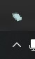
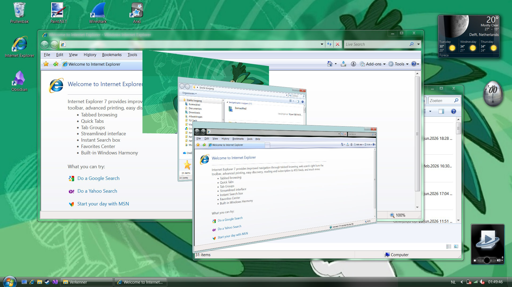
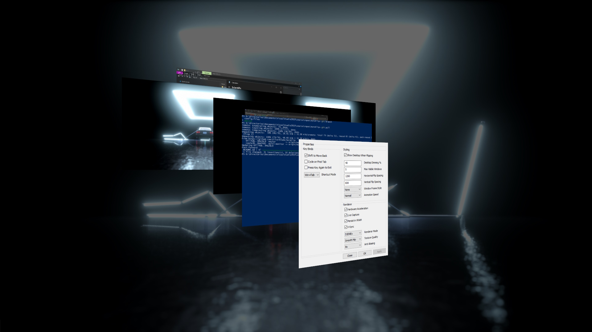
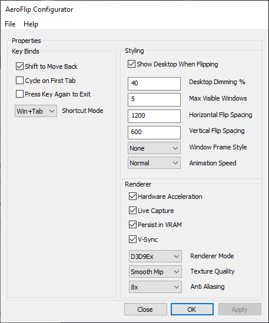

# AeroFlip

Windows Vista/7 Flip3D Win/Alt Tabbing for Windows

# INSTALLING:

Go to the [releases page](https://github.com/ZilverBlade/AeroFlip/releases/), download the latest installer for your architecture (x86 on 32 bit windows, x64 on 64 bit windows). Run the installer as administrator.

AeroFlip automatically starts up after the install process, and launches itself on startup. 

There is a configuration programme (called _AeroFlip Configurator_), which can be found through the start menu, or in the task bar as a notification tray.

### Usage

By default, the Windows Vista behaviour is replicated. Win+Tab is the default flip mode. Press Win+Tab and hold Win to be in flip mode, and press Tab or Shift+Tab to cycle forwards/backwards respectively.

Classic windows 7 window frames are enabled by default, but can be disabled. Support for native window frames is still WIP.

Desktop dimming, and desktop peeking can be configured. By default, the desktop background is displayed and 40% dimmed.

# SCREENSHOTS

_(Running on Windows 10, using other styling tools such as [RetroBar](https://github.com/dremin/Retrobar) and [DWMBlurGlass](https://github.com/Maplespe/DWMBlurGlass), these libraries are NOT included!)_

_(AeroFlip Configurator, screenshot from v1.3)_

### Known bugs:

* Semi-transparent windows slightly leak the desktop. This is not very noticeable but still an issue nonetheless.

# Implementation

_AeroFlip_ uses D3D9Ex to render the virtual Flip environment, and overlays it as a topmost window. It uses `uiAccess=true` in the manifest file to ensure the application always intercepts keybinds, and overlays on top of all windows (including task manager); for this reason the installer comes with a signing script that signs the executable.

# BUILDING:

### PREREQUISITES

**Requires Windows 8+**
*May work on Windows Vista/7, however never tested (And honestly not even needed)*

**Requires Visual Studio 2013**

**Install git submodules**
*after cloning, inside the repository*
`git submodule update --init`

### BUILDING

Open the solution file, and select your target architecture. Then select either Debug or Release build. Enjoy!

**Note: you MUST select exactly your architecture. If you are x64, you cannot run a x86 build, D3D9 will fail to load** 

